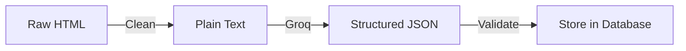

## Extraction Pipeline



## Article Cleaning

Before sending to AI, raw HTML is cleaned:

```python
import re
from bs4 import BeautifulSoup

def clean_html(html):
    soup = BeautifulSoup(html, 'html.parser')
    # Remove scripts, styles, ads
    for tag in soup(['script', 'style', 'nav', 'footer', 'header']):
        tag.decompose()
    text = soup.get_text(separator=' ', strip=True)
    # Normalize whitespace
    text = re.sub(r'\s+', ' ', text)
    return text[:15000]  # Token limit
```

## AI Processing Call

```python
from groq import Groq

client = Groq(api_key=GROQ_API_KEY)

def process_article(article_text):
    response = client.chat.completions.create(
        model="llama-3.3-70b-versatile",
        messages=[{
            "role": "system",
            "content": "You are a Tamil Nadu news analyst. Extract structured data."
        }, {
            "role": "user",
            "content": f"Extract from this article:\n{article_text}"
        }],
        response_format={"type": "json_object"},
        temperature=0.1,
    )
    return json.loads(response.choices[0].message.content)
```

## Categories & Sub-Categories

| Category | Sub-Categories |
|----------|---------------|
| crime_against_women | rape, gangrape, murder, assault, harassment, stalking, dowry |
| crime_against_children | pocso, abduction, murder, assault |
| politics | election, legislation, protest, policy |
| corruption | bribery, misappropriation, scam |
| accident | road, fire, drowning, industrial |
| health | hospital, disease, nutrition |
| education | school, college, exam |
| environment | pollution, conservation, disaster |
