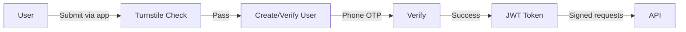

## Authentication Methods

| Method | Purpose |
|--------|---------|
| Cloudflare Turnstile | Bot detection (no captcha) |
| Phone OTP | User verification |
| JWT tokens | Session management |
| API keys | Programmatic access |

## Flow



## Turnstile Integration

Cloudflare Turnstile replaces CAPTCHA — invisible, no user interaction needed.

```typescript
// Frontend widget
const token = await turnstile.render('#widget', {
  sitekey: '0x4AAAA...',
});

// Backend verification
const result = await fetch(
  'https://challenges.cloudflare.com/turnstile/v0/siteverify',
  { method: 'POST', body: JSON.stringify({
    secret: TURNSTILE_SECRET,
    response: token
  })}
);
```

## JWT Tokens

```typescript
interface JWTPayload {
  user_id: string;
  role: 'user' | 'reviewer' | 'expert' | 'admin';
  trust_score: number;
  iat: number;
  exp: number;
}

// Token expires in 7 days
// Signed with a secret stored in Cloudflare Workers env
```
