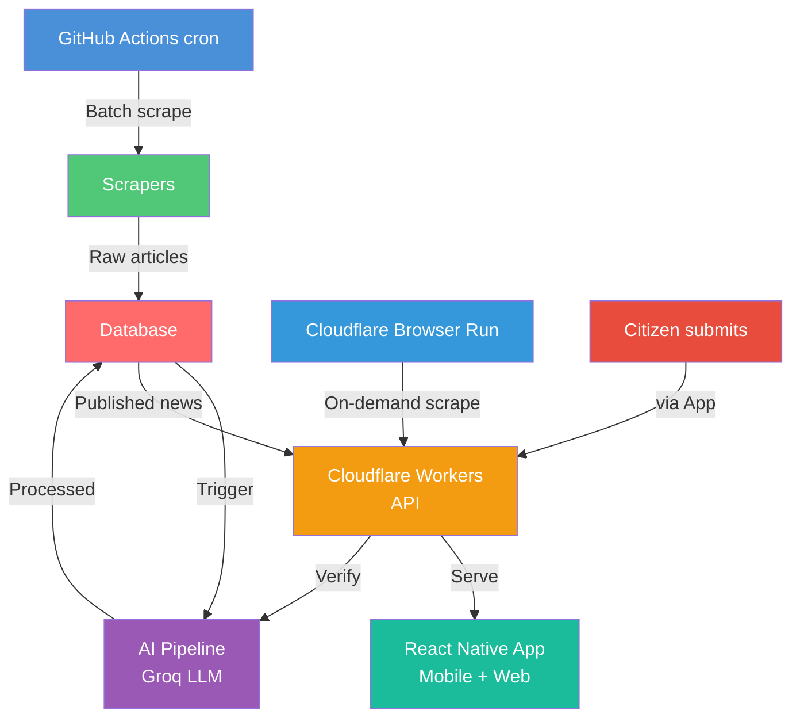
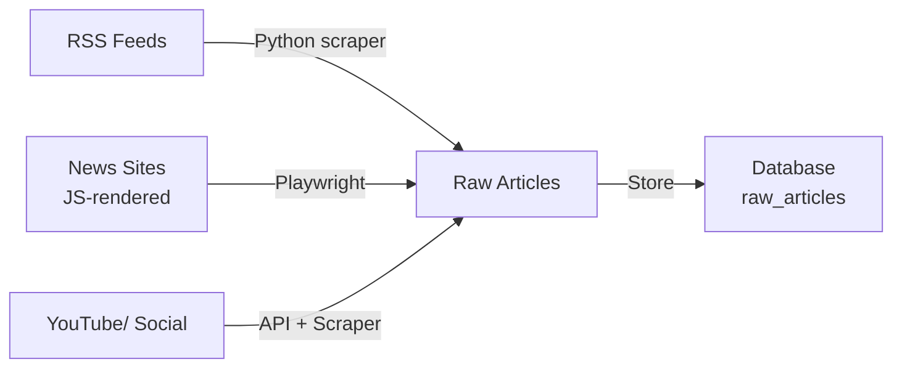
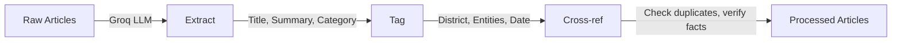
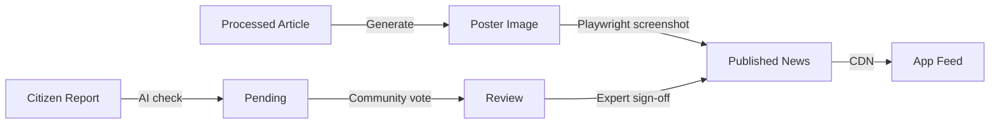

## System Diagram



## Data Flow

### 1. Collection (Scraping Layer)



- **GitHub Actions** runs cron every 30-60 min
- **RSS scraper** (BeautifulSoup) for feeds
- **Playwright scraper** for JS-heavy sites


### 2. Processing (AI Layer)



- **Groq** (Llama 3 / Mixtral) handles:
  - Title extraction (Tamil + English)
  - 50-word and 150-word summaries
  - Category and sub-category classification
  - District/location extraction
  - Key entity identification
  - Initial fact-checking via cross-referencing

### 3. Publishing



- **Poster generation**: HTML template → headless browser → screenshot
- **Citizen news**: follows same pipeline with extra verification layers

## Infrastructure Map

```
┌─────────────────────────────────────────────────┐
│  GITHUB ACTIONS (cron scraping, public repo)    │
│  → Python + Playwright + BeautifulSoup          │
│  → Unlimited run time                           │
└────────────────────┬────────────────────────────┘
                     │
                     ▼
┌─────────────────────────────────────────────────┐
│  CLOUDFLARE WORKERS (API backend)               │
│  → TypeScript (Hono framework)                  │
│                                               │
│  → Auth, verification, citizen submission       │
└────┬────────────┬────────────┬──────────────────┘
     │            │            │
     ▼            ▼            ▼
┌─────────┐ ┌──────────────────┐
│ GROQ    │ │ CLOUDFLARE       │
│ (AI)    │ │ BROWSER RUN      │
│ LLM     │ │ on-demand scrape │
│infra    │ │                  │
└─────────┘ └──────────────────┘
     ▲
     │
┌────┴──────────┐
│  DATABASE     │
│               │
└───────────────┘
     ▲
     │
┌────┴──────────┐
│  REACT NATIVE │
│  (Mobile+Web) │
└───────────────┘
```
