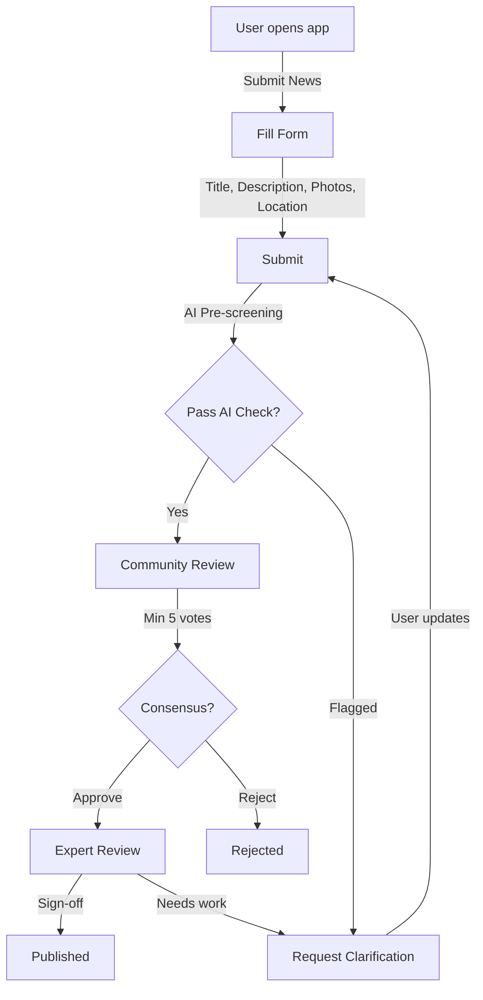

## Submission Flow

## Submission Form

| Field | Required | Type |
|-------|----------|------|
| Title | Yes | Text (max 200 chars) |
| Description | Yes | Text (max 5000 chars) |
| Photos/Videos | No | File upload (max 5) |
| Location | Yes | Map picker / GPS |
| Incident date | Yes | Date picker |
| Source (optional) | No | URL |
| Contact (optional) | No | Phone/Email |

## User Verification

Before submitting, users must verify via:
1. **Cloudflare Turnstile** — bot detection (no captcha)
2. **Phone OTP** — SMS verification (optional)

Repeat submitters with good reputation can skip phone verification.

## Anti-Spam Measures

- Rate limit: 3 submissions per day per user (new users)
- Rate limit: 10 submissions per day (verified users)
- Duplicate check: automated content matching
- IP + device fingerprinting for abuse detection
